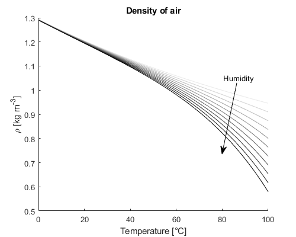

# AirProperties

 Calculates a variety of air thermodynamic properties from the measured temperature, pressure, and humidity.

Variables able to calculated:
 |Name|Symbol|Unit|Description|
 |---|---|---|---|
 | rho | _&rho;_ | kg m-3 | Density
 | mu | _&mu;_ |N s m-2 | Dynamic viscosity
 | k | _k_ | W m-1 K-1 | Thermal conductivity
 | c_p | _cp_ | J kg-1 K-1 | Specific heat capacity (constant pressure)
 | c_v | _cv_ | J kg-1 K-1 | Specific heat capacity (constant volume)
 | gamma | _&gamma;_ | - | Ratio of specific heats
 | c | _c_ | m s-1 | Speed of sound: c = _(&gamma;RT/M)0.5_
 | nu | _&nu;_ | m2 s-1 | Kinematic viscosity: _&nu; = &mu;/&rho;_
 | alpha | _&alpha;_ | m2 s-1 | Thermal diffusivity: _&alpha; = k/(&rho;cp)_
 | Pr | _Pr_ | - | Prandtl number: _Pr = &mu;cp/k_
 | M | _M_ | kg mol-1 | Molar mass of humid air
 | R | _R_ | J kg-1 K-1 | Specific gas constant
 | h | _h_ | % | Relative humidity (if dew point inputted)

Calculations are based around atmospheric temperatures and pressures, i.e. not for the use of high temperature combustion. See references for details and limitations.

Shown here is the air density across a range of temperatures and humidities at standard atmospheric pressure. 

#### References:

Picard, A, Davis, RS, Glaser, M, Fujii, K, 2008, 'Revised formula for the density of moist air (CIPM-2007)', Metrologia, vol. 45, no. 2, pp. 149-155. DOI: http://dx.doi.org/10.1088/0026-1394/45/2/004

Tsilingiris, P, 2008, 'Thermophysical and transport properties of humid air at temperature range between 0 and 100°C', Energy Conversion and Management, vol. 49, no. 5, pp.1098-1110. DOI: https://doi.org/10.1016/j.enconman.2007.09.015
